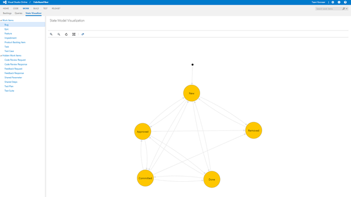
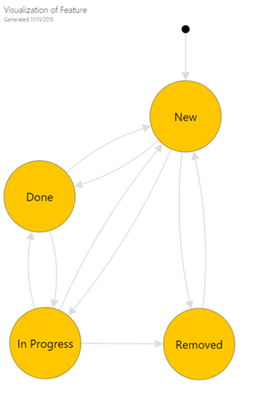

## Visualize work item type states and transitions##

 Every work item type in Visual Studio Team Services has a states, transitions and reasons defined. With this extension you can visualize those states and transitions for regular and hidden work item types.

### Export for offline viewing ###

Export your chart visualization for offline viewing or printing.

## Quick steps to get started ##

- **Visualize**
	1. Navigate to your team project.
	1. Select **WORK** hub group.
	1. Navigate to a **State Visualizer** hub.
	1. Use the left tree view to select work item type and the states and transitions are visualized on the right side.
	1. Click on `Zoom In`, `Zoom Out`, `Zoom to original size` or `Fit To icons` on the toolbar to re-size.
- **Export**
	1. Export the visualization in any browser.
- **State Diagram from Work Item** (NEW)
	1. Open any work item
		- If you are using the classic WI item form, select `State Diagram` on the toolbar.
		- Otherwise click on `...` and select `State Diagram`.
		- State Diagram Visualization dialog will open up for the selected work item type.

## Known issues ##

- Not showing reasons for transitions. Api doesnt expose it yet.

## Learn more ##

The source to this extension is available on GitHub: [StateModelVisualization](https://github.com/melborp/StateModelVisualization). Feel free to take and modify.

To learn more about developing an extension for Visual Studio Team Services, see the [overview of extensions](https://www.visualstudio.com/en-us/integrate/extensions/overview).

[Third Party Notice](https://marketplace.visualstudio.com/_apis/public/gallery/publisher/taavi-koosaar/extension/StateModelVisualization/latest/assetbyname/ThirdPartyNotice.txt).
